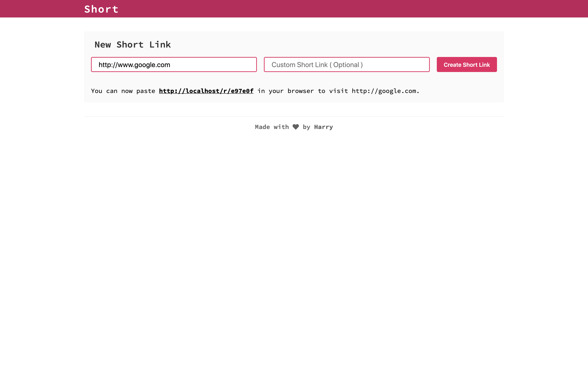

# Short
URL shortening service

## Preview


## Prerequisites
- Yarn v1.17.3
- Go   v1.12.7

## Getting Started

1. Build frontend and backend
```bash
./bin/build
```

## Author
Harry Liu - [byliuyang](https://github.com/byliuyang)

## License
This project is maintained under MIT license