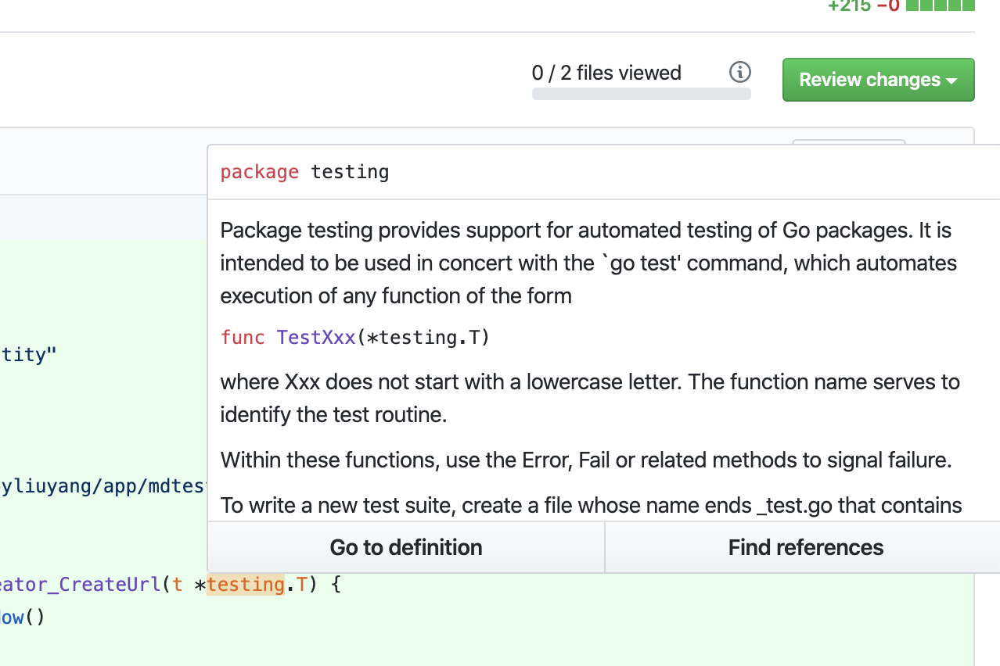

# Short

[](https://ci.time4hacks.com/byliuyang/short)
[](https://codecov.io/gh/byliuyang/short)
[](https://codeclimate.com/github/byliuyang/short/maintainability)
[](https://goreportcard.com/report/github.com/byliuyang/short)
[](https://github.com/byliuyang/short)


## Preview


## Get `s/` Chrome extension

Install it from [Chrome Web Store](https://short-d.com/r/ext) or build it
from [source](https://short-d.com/r/ext-code)

## Getting Started

### Accessing the source code

```bash
git clone https://github.com/byliuyang/short.git
```

### Prerequisites

- Docker v19.03.2

### Configure environmental variables

1. Create `.env` file at project root with the following content:

   ```env
   DOCKERHUB_USERNAME=local
   DB_USER=your_db_user
   DB_PASSWORD=your_db_password
   DB_NAME=your_db_name
   RECAPTCHA_SECRET=your_recaptcha_secret
   GITHUB_CLIENT_ID=your_Github_client_id
   GITHUB_CLIENT_SECRET= your_Github_client_secret
   JWT_SECRET= your_JWT_secret
   WEB_FRONTEND_URL=http://localhost:3000
   WEB_PORT=3000
   HTTP_API_PORT=80
   GRAPHQL_API_PORT=8080
   ```
   
1. Update `DB_USER`, `DB_PASSWORD`, `DB_NAME`, and `JWT_SECRET` with your own
   configurations.

### Create reCAPTCHA account

1. Sign up at [ReCAPTCHA](https://short-d.com/r/recaptcha) with the
   following configurations:

   | Field           | Value          |
   |-----------------|----------------|
   | Label           | `Short`        |
   | reCAPTCHA type  | `reCAPTCHAv3`  |
   | Domains         | `localhost`    |

1. Replace the value of `RECAPTCHA_SECRET` in the `.env` file with `SECRET KEY`.
1. Replace the value of `REACT_APP_RECAPTCHA_SITE_KEY` in
   `frontend/.env.development` file with `SITE_KEY`.

### Create Github OAuth Application

1. Create a new OAuth app at
   [Github Developers](https://short-d.com/r/ghdev) with the
   following configurations:
   
   | Field                      | Value                                            |
   |----------------------------|--------------------------------------------------|
   | Application Name           | `Short`                                          |
   | Homepage URL               | `http://localhost`                               |
   | Application description    | `URL shortening service written in Go and React` |
   | Authorization callback URL | `http://localhost/oauth/github/sign-in/callback` |

1. Replace the value of `GITHUB_CLIENT_ID` in the `.env` file with `Client ID`.
1. Replace the value of `GITHUB_CLIENT_SECRET` in the `.env` file with
   `Client Secret`.

### Generate static assets

Run the following commands at project root:

```bash
docker build -t frontend-build -f Dockerfile-build .
docker run -v $(pwd)/frontend/build:/app/build frontend-build:latest
```

### Build frontend & backend docker images

```bash
docker build -t short-frontend:latest -f frontend/Dockerfile frontend
docker build -t short-backend:latest -f backend/Dockerfile backend
```

### Launch App

```bash
docker-compose up
```

Visit [http://localhost:3000](http://localhost:3000)

## Development

### Dependencies

- Go v1.13.1
- Node.js v12.12.0
- Yarn v1.19.1
- Postgresql v12.0 ( or use [ElephantSQL](https://short-d.com/r/sql) instead )

### Backend

1. Create `.env` under `backend` directory with the following content:

   ```env
   DB_HOST=your_db_host
   DB_PORT=your_db_port
   DB_USER=your_db_user
   DB_PASSWORD=your_db_password
   DB_NAME=your_db_name
   RECAPTCHA_SECRET=your_recaptcha_secret
   GITHUB_CLIENT_ID=your_Github_client_id
   GITHUB_CLIENT_SECRET=your_Github_client_secret
   JWT_SECRET=your_JWT_secret
   WEB_FRONTEND_URL=http://localhost:3000
   ```
   
1. Update `DB_HOST`, `DB_PORT`, `DB_USER`, `DB_PASSWORD`, `DB_NAME`,
   `RECAPTCHA_SECRET`, `GITHUB_CLIENT_ID`, `GITHUB_CLIENT_SECRET`, `JWT_SECRET`
   with your own configurations.

1. Launch backend server

   ```bash
   cd backend
   ./scripts/dev
   ```

1. Remember to install developers tools before start coding:

   ```bash
   ./scripts/tools
   ```

### Frontend

Remember to update `REACT_APP_RECAPTCHA_SITE_KEY` in `frontend/.env.development`.

1. Launch frontend server

   ```bash
   cd frontend
   ./scripts/dev
   ```
   
1. Visit [http://localhost:3000](http://localhost:3000)

## System Design

### Database Modeling


## Deployment

Merging from `master` branch to `production` branch on Github will automatically
deploy the latest code to the production server. This is called continuous
delivery in the DevOps world.


In the future, when there are enough automated tests, we may migrate to
continuous deployment instead.


## Tools We Use

- [Drone](https://short-d.com/r/ci): Continuous integration
  written in Go
- [Sourcegraph](https://short-d.com/r/cs): Code
  search written in Go
  
- [Code Climate](https://short-d.com/r/cs): Automated code
  review
- [ElephantSQL](https://www.elephantsql.com): Managed PostgreSQL service.
- [QuickDBD](https://short-d.com/r/db): Draw database diagrams by
  typing.

## Contributing

When contributing to this repository, please first discuss the change you wish
to make via [Slack channel](https://short-d.com/r/slack) with the owner
of this repository before making a change.

Please open a draft pull request when you are working on an issue so that the
owner knows it is in progress. The owner may take over or reassign the issue if no
body replies after ten days assigned to you.

### Pull Request Process

1. Update the README.md with details of changes to the interface, this includes
   new environment variables, exposed ports, useful file locations and container
   parameters.
1. You may merge the Pull Request in once you have the sign-off of code owner,
   or if you do not have permission to do that, you may request the code owner
   to merge it for you.

### Code of Conduct

- Using welcoming and inclusive language
- Being respectful of differing viewpoints and experiences
- Gracefully accepting constructive criticism
- Focusing on what is best for the community
- Showing empathy towards other community members

### Discussions

Please join this [Slack channel](https://short-d.com/r/slack) to
discuss bugs, dev environment setup, tooling, and coding best practices.

## Author

Harry Liu - *Initial work* - [byliuyang](https://github.com/byliuyang)

## License

This project is maintained under MIT license
