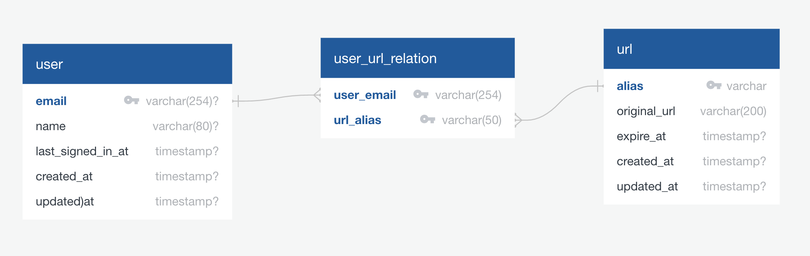

# Short

[](https://ci.time4hacks.com/byliuyang/short)
[](https://codecov.io/gh/byliuyang/short)
[](https://codeclimate.com/github/byliuyang/short/maintainability)
[](https://goreportcard.com/report/github.com/byliuyang/short)
[](https://github.com/byliuyang/short)


## Preview


## Get `s/` Chrome extension

Install it from [Chrome Web Store](https://short-d.com/r/ext) or build it
from [source](https://short-d.com/r/ext-code)

## Getting Started

### Accessing the source code

```bash
git clone https://github.com/byliuyang/short.git
```

### Prerequisites

- Go v1.13.1
- Node.js v12.12.0
- Yarn v1.19.1
- Postgresql v12.0 ( or use [ElephantSQL](https://short-d.com/r/sql) instead )

### Create reCAPTCHA account

1. Sign up at [ReCAPTCHA](https://short-d.com/r/recaptcha) with the
   following configurations:

   | Field           | Value          |
   |-----------------|----------------|
   | Label           | `Short`        |
   | reCAPTCHA type  | `reCAPTCHAv3`  |
   | Domains         | `localhost`    |

1. Replace the value of `RECAPTCHA_SECRET` in the `.env` file with `SECRET KEY`.
1. Replace the value of `REACT_APP_RECAPTCHA_SITE_KEY` in
   `frontend/.env.development` file with `SITE_KEY`.

### Create Github OAuth application

1. Create a new OAuth app at
   [Github Developers](https://short-d.com/r/ghdev) with the
   following configurations:

   | Field                      | Value                                            |
   |----------------------------|--------------------------------------------------|
   | Application Name           | `Short`                                          |
   | Homepage URL               | `http://localhost`                               |
   | Application description    | `URL shortening service written in Go and React` |
   | Authorization callback URL | `http://localhost/oauth/github/sign-in/callback` |

1. Replace the value of `GITHUB_CLIENT_ID` in the `.env` file with `Client ID`.
1. Replace the value of `GITHUB_CLIENT_SECRET` in the `.env` file with
   `Client Secret`.

### Create Facebook Application

1. Create a new app at
   [Facebook Developers](https://short-d.com/r/fbdev) with name `Short`
1. Add `Facebook Login` product to the app
1. Copy `App ID` and `App Secret` on `Settings->Basic` tab
1. Replace the value of `FACEBOOK_CLIENT_ID` in the `.env` file with `App ID`.
1. Replace the value of `FACEBOOK_CLIENT_SECRET` in the `.env` file with
   `App Secret`.

### Backend

1. Copy `.env.dist` file to `.env`:

   ```bash
   cp .env.dist .env
   ```

1. Update `DB_HOST`, `DB_PORT`, `DB_USER`, `DB_PASSWORD`, `DB_NAME`,
   `RECAPTCHA_SECRET`, `GITHUB_CLIENT_ID`, `GITHUB_CLIENT_SECRET`, `JWT_SECRET`,
   `FACEBOOK_CLIENT_ID`, `FACEBOOK_CLIENT_SECRET`, `FACEBOOK_REDIRECT_URI` with
   your own configurations.

1. Launch backend server

   ```bash
   cd backend
   ./scripts/dev
   ```

1. Remember to install developers tools before start coding:

   ```bash
   ./scripts/tools
   ```

### Frontend

Remember to update `REACT_APP_RECAPTCHA_SITE_KEY` in `frontend/.env.development`.

1. Launch frontend server

   ```bash
   cd frontend
   ./scripts/dev
   ```

1. Visit [http://localhost:3000](http://localhost:3000)

## System Design

### App Level Architecture

Short backend is built on top of
[Uncle Bob's Clean Architecture](https://api.short-d.com/r/ca), the central
objective of which is separation of concerns.


It enables the developers to modify a single component of the system at a time
while leaving the rest unchanged. This minizes the amount of changes have to
be made in order to support new requirements as the system grows. Clean
Architecture also improves the testability of system, which in turn saves
precious time when creating automated tests.

Here is an exmample of finance app using clean architecture:


### Service Level Archtecture

Short adopts [Microservices Architecture](https://api.short-d.com/r/ms) to
organize dependent services around business capabilities and to enable
independent deployment of each service.


### Dependency Management

Short leverages class design, package cohesion, and package coupling princiapls
from C++ world to manage its internal dependencies.

#### Class Design

| Principal                                                        | Description                                                            |
|------------------------------------------------------------------|------------------------------------------------------------------------|
| [Single Responsibility Principle](https://api.short-d.com/r/srp) | A class should have one, and only one, reason to change.               |
| [Open Closed Principle](https://api.short-d.com/r/ocp)           | You should be able to extend a classes behavior, without modifying it. |
| [Liskov Substitution Principle](https://api.short-d.com/r/lsp)   | Derived classes must be substitutable for their base classes.          |
| [Interface Segregation Principle](https://api.short-d.com/r/isp) | Make fine grained interfaces that are client specific.                 |
| [Dependency Inversion Principle](https://api.short-d.com/r/dip)  | Depend on abstractions, not on concretions.                            |

#### Package Cohesion

| Principal                                                            | Description                                           |
|----------------------------------------------------------------------|-------------------------------------------------------|
| [Release Reuse Equivalency Principle](https://api.short-d.com/r/rep) | The granule of reuse is the granule of release.       |
| [The Common Closure Principle](https://api.short-d.com/r/ccp)        | Classes that change together are packaged together.   |
| [The Common Reuse Principle](https://api.short-d.com/r/crp)          | Classes that are used together are packaged together. |

#### Package Coupling

| Principal                                                       | Description                                           |
|-----------------------------------------------------------------|-------------------------------------------------------|
| [Acyclic Dependencies Principle](https://api.short-d.com/r/adp) | The dependency graph of packages must have no cycles. |
| [Stable Dependencies Principle](https://api.short-d.com/r/sdp)  | Depend in the direction of stability.                 |
| [Stable Abstractions Principle](https://api.short-d.com/r/sap)  | Abstractness increases with stability.                |

### Dependency Injection

Short produces flexible and loosely coupled code, by explicitly providing
components with all of the dependencies they need.

```go
type Authenticator struct {
  tokenizer          fw.CryptoTokenizer
  timer              fw.Timer
  tokenValidDuration time.Duration
}

func NewAuthenticator(
  tokenizer fw.CryptoTokenizer,
  timer fw.Timer,
  tokenValidDuration time.Duration,
) Authenticator {
  return Authenticator{
    tokenizer:          tokenizer,
    timer:              timer,
    tokenValidDuration: tokenValidDuration,
  }
}
```

Short also simplifies the management of the big block of order-dependent
initialization code with [Wire](https://api.short-d.com/r/wire), a compile time
depedency injection framework by Google.

```go
func InjectGraphQlService(
  name string,
  sqlDB *sql.DB,
  graphqlPath provider.GraphQlPath,
  secret provider.ReCaptchaSecret,
  jwtSecret provider.JwtSecret,
  bufferSize provider.KeyGenBufferSize,
  kgsRPCConfig provider.KgsRPCConfig,
) (mdservice.Service, error) {
  wire.Build(
    wire.Bind(new(fw.GraphQlAPI), new(graphql.Short)),
    wire.Bind(new(url.Retriever), new(url.RetrieverPersist)),
    wire.Bind(new(url.Creator), new(url.CreatorPersist)),
    wire.Bind(new(repo.UserURLRelation), new(db.UserURLRelationSQL)),
    wire.Bind(new(repo.URL), new(*db.URLSql)),
    wire.Bind(new(keygen.KeyGenerator), new(keygen.Remote)),
    wire.Bind(new(service.KeyFetcher), new(kgs.RPC)),

    observabilitySet,
    authSet,

    mdservice.New,
    provider.NewGraphGophers,
    mdhttp.NewClient,
    mdrequest.NewHTTP,
    mdtimer.NewTimer,

    db.NewURLSql,
    db.NewUserURLRelationSQL,
    provider.NewRemote,
    url.NewRetrieverPersist,
    url.NewCreatorPersist,
    provider.NewKgsRPC,
    provider.NewReCaptchaService,
    requester.NewVerifier,
    graphql.NewShort,
  )
  return mdservice.Service{}, nil
}
```

### Database Modeling



## Deployment

Short leverages [Kubernetes](https://kubernetes.io) to automate deployment, scaling,
and management of containerized microservices.


Short uses [GitOps](https://github.com/byliuyang/gitops) to manage Kubernetes cluster.


### Staging

Merging pull request into master branch on Github will automatically deploy the
changes to [staging](https://staging.short-d.com) environment.

### Production

Merging from `master` branch to `production` branch will automatically
deploy the latest code to the production. This is called continuous
delivery in the DevOps world.


In the future, when there are enough automated tests, we may migrate to
continuous deployment instead.


## Tools We Use

- [Drone](https://short-d.com/r/ci): Continuous integration
  written in Go
- [Code Climate](https://short-d.com/r/cs): Automated code
  review
- [ElephantSQL](https://www.elephantsql.com): Managed PostgreSQL service.

## Contributing

Please read [CONTRIBUTING.md](CONTRIBUTING.md) for details on our code of conduct,
and the process for submitting pull requests to us.

## Author

Harry Liu - *Initial work* - [byliuyang](https://short-d.com/r/ghharry)

## License

This project is maintained under MIT license
